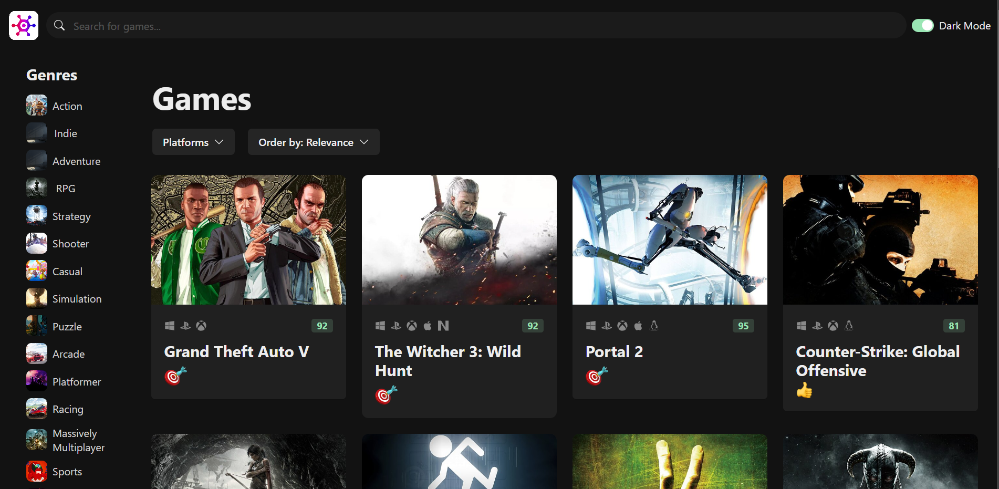
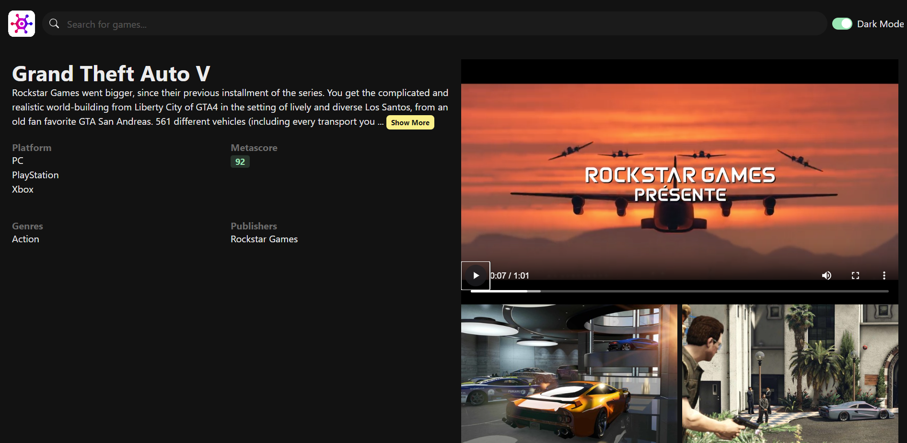
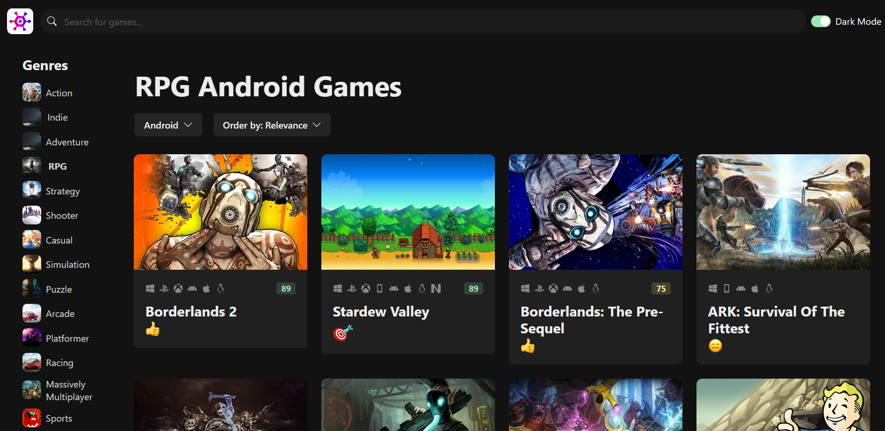
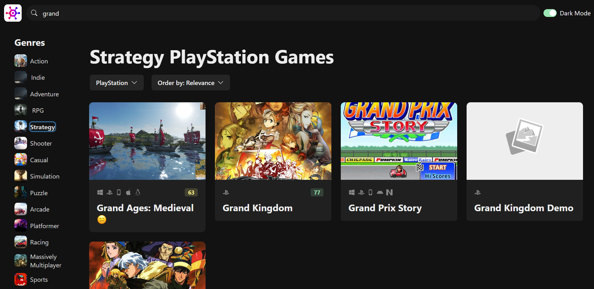

# Fake_Rawg.io

Fake_Rawg.io is a web application that simulates the functionality of the popular video game database RAWG.io. This project is built using TypeScript and modern web technologies to provide a responsive and interactive user experience for browsing and exploring video game information.

## Features

- Browse a vast collection of video games
- Search for specific games
- View detailed information about each game
- Filter games by various criteria (e.g., platform, genre, release date)
- Responsive design for optimal viewing on different devices

## Screenshots
- Landing Page

- See Game Details Page by clicking on the title

- Select Games by Genre/Platform

- Search the game by title

## Technologies Used

- TypeScript
- React
- Vite
- CSS Modules

## Project Structure

The project follows a typical React application structure:

- `src/`: Contains the main source code
  - `components/`: Reusable React components
  - `hooks/`: Custom React hooks
  - `services/`: API and data fetching services
  - `pages/`: Main page components
  - `utils/`: Utility functions and helpers

## Setup and Installation

1. Clone the repository:
   git clone https://github.com/Muawaz/Fake_Rawg.io.git
2. Navigate to the project directory:
   cd Fake_Rawg.io
3. Install dependencies:
   npm install
4. Run the development server:
   npm run dev
5. Open your browser and visit `http://localhost:3000` to view the application.

## Contributing

Contributions are welcome! Please feel free to submit a Pull Request.

## License

This project is open source and available under the [MIT License](LICENSE).

## Deployment

This project is deployed on Vercel. You can view the live version at [fakerawgio-muawaz-saleems-projects.vercel.app](https://rawgiofake-2cg76nkwz-muawaz-saleems-projects.vercel.app/).

## Acknowledgements

- Inspired by [RAWG.io](https://rawg.io/)
- Built with [React](https://reactjs.org/) and [TypeScript](https://www.typescriptlang.org/)
